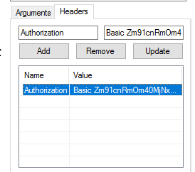

# i

i is a minimal program for uploading files to your server and getting a "i.example.com/file.png" link back, similar to imgur.com. It is compatible with the open source image capture program [Share X](https://getsharex.com/).

It does ***not*** serve the files or handle authentification. It is meant to be used with a server like nginx or caddy.

## what you need to build
 - golang

## how to use
 - Open `i.go` and edit the configuration (set the `root` and `webRoot` variable to your desired values)
 - Compile with `go build`
 - Create a init.d service (if you are using another system skip this part)
   - Copy the exampleservice file to /etc/init.d/ and call it `i`
   - Edit it and change the `WWW_USER` to the user you want and `APPROOT` to the directory that the executable is in.
   - Make it executable `sudo chmod +x /etc/init.d/i`
   - Make it a service `sudo update-rc.d i defaults`
 - Add a custom sharex uploader like this: 

## if you are using nginx
 - Install the `apach2-utils` to generate a htpasswd file for authentification
 - Create a reverse proxy for your webserver. For example use i.example.com/upload to upload the images (by default to port 9005). Add basic auth to hande the authentification.
    ```
    location /upload {
        auth_basic "Restricted Content";
        auth_basic_user_file /etc/fileupload.htpasswd;
        proxy_pass http://localhost:9005;
    }
    ```
 - Create a .htpasswd file using `htpasswd -c /etc/fileupload.htpasswd user` and enter a password.
 - Base64 encode user:password `echo -n user:yourpassword | base64` and add a header `Authorization: Basic <your base64>` in sharex 
 
    

## if you are using caddy
 - Create a reverse proxy for your webserver. For example use i.example.com/upload to upload the images (by default to port 9005). Add basic auth to hande the authentification.
    ```
    i.example.com {
        root /var/www/i.example.com
   
        basicauth /upload user yourpassword
        proxy /upload localhost:9005
    }
    ```
 - Base64 encode user:password `echo -n user:yourpassword | base64` and add a header `Authorization: Basic <your base64>` in sharex (image in the nginx example)

## if you are using apache2
 - idk figure it out, should be similar to nginx ¯\\\_(ツ)\_/¯
